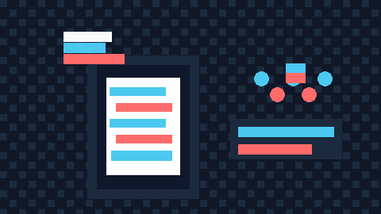

# Evven Landing Page

A bright, playful landing experience for Evven — the simple way to split bills, track shared expenses, and keep money talk out of your friendships.

<p align="center">
  
</p>

## ✨ What this page does

- Shows the Evven product in a friendly, modern way
- Highlights shared expense tracking and easy balance settling
- Uses simple animated sections to make the experience feel alive

## 🚀 Run locally

```bash
npm install
npm run dev
```

Then open http://localhost:3000.

## 🧩 Tech stack

- Next.js
- React
- Tailwind CSS
- Framer Motion

## 🎨 Project vibe

Evven is built around a calm, helpful feeling — quick to understand, easy to use, and a little bit charming.
